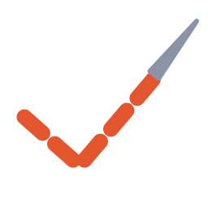

<div align="center">



# hilván

*Hilvanar es coser con puntadas largas y flojas para comprobar que una prenda
cae bien, antes de rematarla. Esto hace lo mismo con el patrón.*

### ¿Este patrón de costura se puede coser de verdad?

Un linter para patrones 2D. Mide la geometría de cada panel, el grafo de
costuras y la vestibilidad de la prenda montada, y explica cada fallo en un
formato que un modelo puede leer para corregirse.

[](https://www.python.org/)
[](#licencia)
[](#estado-y-límites-conocidos)
[](#barrido-de-un-corpus)

**1 de cada 5** patrones del corpus con el que se entrenan los modelos tiene un
defecto geométrico duro.&nbsp;&nbsp;·&nbsp;&nbsp;De lo que genera un modelo del
estado del arte, como mucho **el 23%** está libre de ellos, frente al **78%**
del corpus.

</div>

---

```console
$ hilvan rand_023FMIGQK0_specification.json
{
 "valido": true,
 "sin_defecto_duro": true,
 "validado": false,
 "errores": 2,
 "avisos": 11,
 "por_codigo": {
  "desajuste_no_declarado": 2,
  "acabado_no_declarado": 1,
  "fruncido_no_declarado": 5,
  "quiebre_en_cruce": 4,
  "montaje_supuesto": 1,
  "bordes_libres": 1,
  "costuras_en_redondo": 1,
  "abertura": 4
 }
}

ERROR  desajuste_no_declarado [costura 21]: los bordes miden 122.77 y 109.69 cm (10.6% de diferencia) y no hay declaracion de fruncido o embebido
AVISO  quiebre_en_cruce [costura 3]: al unir los paneles el contorno pasa de right_ftorso.3 a right_btorso.2 formando 230.8 grados en vez de 180 (50.8 de quiebre): la linea no sigue suave al cruzar la costura
INFO   costuras_en_redondo: 14 de 27 costuras cierran un tubo y hay que coserlas en redondo; las demas se pueden coser en plano
…                                                              (16 hallazgos mas)
```

Ese patrón sale del corpus publicado de GarmentCode: ya filtrado por sus
autores y superviviente de la simulación física. Aun así dos de sus costuras
unen bordes de longitudes distintas —cosidos, no cierran— y el contorno da un
quiebre de 50° al cruzar el costado. El comando termina con código `1`, así que
encadena en un pipeline igual que cualquier linter.

Nace de un proyecto de diseño de moda AI-First: un modelo genera los patrones 2D
a partir de texto o imágenes y la simulación 3D la hacen herramientas existentes.
El cuello de botella no es generar formas, sino que las formas resultantes se
puedan coser.

## Tabla de contenidos

- [Motivación](#motivación)
- [Paper](#paper)
- [Instalación](#instalación)
- [Uso](#uso)
- [Declarar la intención](#declarar-la-intención)
- [Comprobaciones](#comprobaciones)
- [Vestibilidad](#vestibilidad)
- [Barrido de un corpus](#barrido-de-un-corpus)
- [Salida para reparación automática](#salida-para-reparación-automática)
- [Configuración de umbrales](#configuración-de-umbrales)
- [Desarrollo](#desarrollo)
- [Estado y límites conocidos](#estado-y-límites-conocidos)
- [Estructura del repositorio](#estructura-del-repositorio)
- [Contribuir](#contribuir)
- [Licencia](#licencia)
- [Agradecimientos](#agradecimientos)

## Motivación

Los sistemas actuales validan muy poco. GarmentCode, el más completo de los
proyectos abiertos, además de comprobar que los parámetros de diseño sean
compatibles, solo mira dos cosas de la geometría: que un panel no se cruce
consigo mismo y que la prenda no arrastre por el suelo.

Sobre **3.450 patrones del corpus publicado GarmentCodeData v2**, ya filtrados
por sus autores y supervivientes de la simulación física, este validador
encuentra que:

| | Patrones | % |
| --- | ---: | ---: |
| Tienen un defecto geométrico duro | 705 | **20,4** |
| Solo les falta declarar la intención de una costura | 2.383 | 69,1 |
| Pasan la validación completa (cero errores) | 362 | 10,5 |

Un **defecto duro** es uno que ninguna declaración puede excusar: un borde
demasiado corto para cortarlo (hasta 0,018 cm), una esquina demasiado aguda
para coserla (hasta 0,12°), una curva demasiado cerrada, un panel que no cabe
en el rollo o un contorno que se cruza a sí mismo. Los otros dos tercios no son
necesariamente defectuosos: son *indistinguibles* de un defecto, porque el
formato no guarda si un desajuste era buscado.

Que los patrones sobrevivieron a la simulación está comprobado: cada lote
publica la lista de prendas cuya simulación falló (1.551 en este) y ninguna
está entre las medidas. El resultado tampoco depende del lote ni de los
umbrales exactos:

- En otros dos lotes, el defecto duro aparece en el 19,6% y el 20,0% de los
  patrones.
- Barriendo la longitud mínima de borde entre 0,25 y 1 cm y el ángulo mínimo
  entre 10° y 20°, el porcentaje se mueve entre el 15% y el 32%.
- Fusionar vértices a menos de 1 mm, como haría un CAD al importar, lo deja en
  el 19,2%: la mayoría de los bordes cortos están cosidos a otro panel, no son
  vértices duplicados.

La metodología está en
[`docs/hallazgos-corpus.md`](docs/hallazgos-corpus.md); la fase 1, sobre 30
patrones, en [`docs/hallazgos-fase1.md`](docs/hallazgos-fase1.md).

### Y lo que genera un modelo del estado del arte

La misma vara aplicada a [AIpparel](https://georgenakayama.github.io/AIpparel/)
sobre 100 prendas del corpus, cada una pedida por imagen y por texto:

| | Sin defecto duro | Validación completa | Costuras | Costuras desajustadas |
| --- | ---: | ---: | ---: | ---: |
| AIpparel, desde imagen | **23 de 100** | 0 de 100 | 31,6 | 88% |
| AIpparel, desde texto | **17 de 100** | 0 de 100 | 26,8 | 86% |
| Corpus (ground truth) | 78 de 100 | 12 de 100 | 31,5 | 33% |

Una costura está desajustada si sus dos lados difieren en más de un 1% sin
declaración. AIpparel genera patrones con tantas costuras como el corpus (31,6
contra 31,5) y desajusta casi todas: los dos bordes de una costura salen de
predicciones independientes y nada los obliga a medir lo mismo. El modo de
entrada no cambia el resultado (McNemar pareado, p = 0,345). Ninguno de los 200
pasa la validación completa; con 0 de 200, la cota superior exacta del 95%
(Clopper-Pearson, unilateral) es 1,5%. Detalle y cautelas en
[`docs/hallazgos-aipparel.md`](docs/hallazgos-aipparel.md).

Medir un modelo que emite *parámetros* en vez de geometría exige pasar su salida
por GarmentCode antes de validarla, así que el número mediría la pareja. Pasando
los parámetros verdaderos de esas 100 prendas por el mismo sintetizador se ve
cuánto aporta: reproduce el veredicto del patrón publicado en **99 de 100**. La
asimetría es una cota de un punto, no un agujero
([`docs/hallazgos-sintetizador.md`](docs/hallazgos-sintetizador.md)).

## Paper

Los resultados están escritos en [`docs/paper/main.tex`](docs/paper/main.tex),
*Valid Is Not Manufacturable: Auditing Generative Sewing Patterns at Corpus
Scale*. Todas sus cifras y figuras salen del corpus con scripts de
[`research/`](research/), no se copian a mano:

```bash
python research/numeros_paper.py data/garmentcodedata_0 data/garmentcodedata_0_random
python research/figuras_paper.py data/garmentcodedata_0 docs/paper/figs
python research/sensibilidad_umbrales.py data/garmentcodedata_0 docs/paper/figs
python research/fusion_vertices.py data/garmentcodedata_0
```

Para compilarlo, dentro de `docs/paper/`:
`pdflatex main && bibtex main && pdflatex main && pdflatex main`.

Queda pendiente una auditoría manual de precisión: una muestra estratificada
de 100 hallazgos, con semilla fija, en [`docs/auditoria/`](docs/auditoria/),
cada uno con un SVG del elemento señalado y una fila en `auditoria.csv` cuyo
veredicto rellena una persona.

## Instalación

Requisitos: Python 3.10 o superior.

```bash
pip install -e .
```

Las únicas dependencias son `numpy` (1.x o 2.x) y `svgpathtools`. **No requiere
GarmentCode**: lee su formato JSON, pero no depende del paquete.

Para correr los scripts de [`research/`](research/) que miden el corpus y
regeneran las figuras del paper:

```bash
pip install -e ".[research]"
```

## Uso

### Línea de comandos

```bash
hilvan patron_specification.json            # informe legible
hilvan patron_specification.json --modelo   # errores en JSON
```

El código de salida es `0` si el patrón pasa la validación completa, `1` si no,
y `2` si el error es de uso o de lectura (archivo inexistente, JSON inválido,
clave desconocida), de modo que puede encadenarse en scripts y pipelines de CI.

Cualquier umbral de `Limites` se puede cargar desde un JSON; los flags sueltos
mandan sobre el archivo:

```bash
hilvan patron.json --limites limites.json   # {"largo_min_borde": 0.3, "tol_costura": 0.02}
```

### API de Python

```python
from hilvan import validar, resumen, para_modelo, Limites

hallazgos = validar(spec, Limites(ancho_rollo=140, angulo_min_esquina=12))

if not resumen(hallazgos)["validado"]:
    prompt_de_reparacion = para_modelo(hallazgos)
```

`resumen` da el veredicto en los tres niveles del paper: `valido` (el patrón se
interpreta y el grafo de costuras resuelve), `sin_defecto_duro` y `validado`
(ningún error). Hasta la versión 0.1.0, `valido` significaba lo que hoy es
`validado`.

## Declarar la intención

GarmentCode guarda cada costura como `{panel, edge}` y no indica si una
diferencia de longitud entre sus dos bordes es un fruncido buscado o un defecto.
Sin esa información nadie puede distinguirlos: en el corpus medido, el 31,8% de
las costuras (33.092 de 104.064) tiene los dos lados con longitudes que
difieren en más de un 1%.

Por eso el validador acepta un campo opcional `ease`:

```json
{"panel": "falda_f", "edge": 2,
 "ease": {"type": "gather", "ratio": 1.4, "tol": 0.05}}
```

| Campo | Significado |
| --- | --- |
| `type` | `gather` (fruncido), `ease` (embebido), `stretch` (tejido elástico) |
| `ratio` | largo del borde que declara el `ease` dividido por el del borde opuesto: más de 1 si se declara en el lado largo, menos de 1 en el corto |
| `tol` | tolerancia relativa sobre ese ratio (por defecto `0.05`) |

Declarado y coherente con la geometría, el patrón es válido. Declarado pero
falso, se reporta `ease_incongruente`. Sin declarar, depende del tamaño del
desajuste:

| Desajuste sin declarar | Resultado |
| --- | --- |
| hasta 1% | pasa: es redondeo del trazado |
| entre 1% y 15% | error `desajuste_no_declarado` |
| más de 15% | aviso `fruncido_no_declarado`: casi seguro es un fruncido que nadie escribió |

La tercera zona no es marginal: el 47% de los desajustes del corpus cae en ella.

El mismo hueco existe en los bordes que no se cosen: un dobladillo bien rematado
y un borde olvidado son el mismo dato. El borde declara su acabado en el panel:

```json
{"endpoints": [3, 4], "finish": {"type": "hem"}}
```

Los tipos son `hem` (dobladillo), `facing` (vista), `binding` (ribete),
`opening` (abertura) y `raw` (borde crudo a propósito). Declararlo sobre un
borde que sí se cose es `acabado_incongruente`; no declararlo queda en aviso.

Sin declarar **no** es error, a diferencia del desajuste de costura: allí hay un
disparador geométrico — los largos no calzan — y aquí no. Marcarlo como error
invalidaría de golpe el 100% de los patrones existentes, que es justo el fallo
del que este validador ya salió una vez.

### Orientación de la costura

El tercer hueco, y el único que no se puede contrastar contra la geometría. El
formato no dice qué extremo de un borde se cose con cuál del otro, y no hay de
dónde deducirlo: la colocación 3D del JSON es la posición inicial del simulador
y deja los paneles separados. La costura lo declara con `orient`:

```json
[{"panel": "delantero", "edge": 3, "orient": "reversed"},
 {"panel": "espalda", "edge": 1}]
```

`direct` cose el primer extremo de un borde con el primero del otro;
`reversed`, con el segundo. Sin declarar, la continuidad prueba los dos y se
queda con el que mejor deja al patrón, así que **subestima**: cada hallazgo
dice en `medido["emparejamiento"]` si viene de una declaración o de una
deducción, porque el deducido es una cota inferior.

Un borde sin coser solo puede continuar en otro borde sin coser. Si la
orientación declarada encaja en menos cruces que la contraria, se reporta
`orientacion_dudosa`. En la camiseta de prueba, `reversed` encaja en 12 cruces
y `direct` en 4. Sobre los 3.450 patrones del corpus, `reversed` gana en 3.310,
empata en 140 y pierde en ninguno, con una mediana de 8 cruces de ventaja: por
eso es el convenio por defecto cuando la costura no declara nada.

Para patrones de otro generador ese convenio no está garantizado:
`hilvan patron.json --orientacion deducida` (o
`Limites(orientacion_por_defecto=None)`) lo decide la topología para el patrón
entero, sumando los cruces de todas sus costuras. La continuidad siempre evalúa
las costuras sin declarar con el emparejamiento más favorable, para que su aviso
sea una cota inferior; el montaje del nivel 2 necesita una sola orientación
coherente y usa el convenio o la deducción global.

## Comprobaciones

### Nivel 0 — geometría de cada panel

| Código | Qué detecta |
| --- | --- |
| `vertice_inexistente` | un borde apunta a un vértice fuera de rango |
| `contorno_abierto` | los bordes no forman un ciclo cerrado |
| `vertice_huerfano` | vértice que ningún borde usa |
| `borde_degenerado` | borde más corto que el mínimo cortable |
| `curvatura_excesiva` | radio de curvatura por debajo del mínimo cosible |
| `esquina_aguda` | ángulo demasiado cerrado para coserse |
| `pico_de_pinza` | esquina aguda reconocida como pinza legítima (info) |
| `auto_interseccion` | dos bordes del panel se cruzan fuera de un vértice |
| `excede_ancho_rollo` | el panel no cabe en el ancho de tela ni girándolo |

### Nivel 1 — grafo de costuras

| Código | Qué detecta |
| --- | --- |
| `costura_no_binaria` | una costura que no une exactamente dos bordes |
| `panel_inexistente`, `borde_inexistente` | referencia rota |
| `costura_nula` | ambos bordes con longitud cero |
| `desajuste_no_declarado` | diferencia de longitud entre 1% y 15%, sin declarar |
| `fruncido_no_declarado` | diferencia mayor al 15%: probablemente intencional (aviso) |
| `ease_incongruente` | el ratio declarado no coincide con la geometría |
| `borde_multicosido` | un borde que aparece en más de una costura |
| `panel_suelto` | panel que no está cosido a nada |
| `quiebre_en_cruce` | el contorno no sigue suave al cruzar una costura (aviso) |
| `esquina_de_diseno` | quiebre entre dos bordes rectos: esquina dibujada (info) |
| `prenda_desconectada` | los paneles forman varios grupos separados (aviso) |
| `acabado_no_declarado` | bordes sin coser que no dicen cómo se rematan (aviso) |
| `acabado_incongruente` | acabado declarado sobre un borde cosido, o de tipo desconocido |
| `orientacion_incongruente` | la orientación declarada no es `direct` ni `reversed` |
| `orientacion_dudosa` | la orientación declarada contradice el contorno libre (aviso) |
| `costuras_en_redondo` | cuántas costuras cierran un tubo (info) |
| `bordes_libres` | cuántos bordes quedan sin coser (info) |

### Nivel 2 — vestibilidad, sin simulación

| Código | Qué detecta |
| --- | --- |
| `prenda_sellada` | ningún borde queda libre: no hay por dónde entrar |
| `abertura_insuficiente` | el cuerpo no pasa por la abertura declarada |
| `abertura` | contorno de cada abertura de la prenda montada (info) |
| `montaje_supuesto` | falta `orient`, así que se mide pero no se juzga (aviso) |
| `montaje_incoherente` | el contorno montado no se puede recorrer (aviso) |

## Vestibilidad

Los bordes que no se cosen forman bucles cerrados en la prenda montada — escote,
bajo, puños — y el contorno de cada uno es la suma de las longitudes de sus
bordes. Con una medida del cuerpo, eso responde si la cabeza pasa por el escote
sin necesidad de simular nada.

```python
from hilvan import validar, Cuerpo

hallazgos = validar(spec, cuerpo=Cuerpo(head=57, hip=100))
```

Sin `cuerpo`, las aberturas se miden y se informan, pero no se juzgan. Ningún
patrón de GarmentCodeData declara `fits`, así que sobre el corpus el nivel 2
solo mide: todos los patrones montan un contorno coherente, con una mediana de
cuatro aberturas, y en 171 (el 5%) la más pequeña mide menos que los 21 cm de
contorno de mano del cuerpo de referencia.

Una abertura declara qué medida tiene que dejar pasar, y con qué ayuda:

```json
{"endpoints": [3, 4],
 "finish": {"type": "opening", "fits": "head", "stretch": 1.5}}
```

`fits` nombra un campo de `Cuerpo`; `stretch` es cuánto da de sí el tejido en esa
abertura; `closure` (`zip`, `buttons`) dice que se abre para pasar y exime del
chequeo. Sin `stretch` ni `closure`, un escote de punto se marcaría como
inservible — es la misma excepción que las pinzas y los godets, por cuarta vez.

**El montaje depende de `orient`.** Con la orientación equivocada, los cuatro
huecos de una camiseta salen como dos bucles de 129,6 cm. Si alguna costura no
la declara se usa el convenio por defecto y los veredictos bajan de error a
aviso — medido sobre 3.450 patrones de GarmentCodeData, ese convenio gana en
3.310 y pierde en ninguno, así que respalda el hallazgo aunque el patrón no lo
afirme.

La parte que sí necesita simulación — drapeado, tensión, poses — no está
implementada a propósito; el plan está en
[`docs/nivel2-simulado.md`](docs/nivel2-simulado.md).

## Barrido de un corpus

El uso con más retorno no es el bucle de reparación: es filtrar el corpus de
entrenamiento. Si uno de cada cinco patrones publicados tiene un defecto duro,
las 115.000 prendas de GarmentCodeData lo tienen también en esa proporción, y
un modelo entrenado sobre ellas lo aprende como construcción correcta.

```bash
hilvan GarmentCodeData/ --lote --salida informe.json
```

Recorre el directorio, valida cada patrón y escribe el recuento por código más
un manifiesto con los que pasan la validación completa. No necesita
GarmentCode: lee los JSON ya generados. A unos 10 ms por patrón, 115.000 son
unos 20 minutos en un núcleo. Un archivo ilegible se anota y el barrido sigue.

**Ese manifiesto no es el que conviene para entrenar.** Quedarse solo con los
patrones sin ningún error conserva el 10,5% del corpus y lo sesga hacia prendas
simples: los errores se acumulan con el número de costuras aunque la tasa por
costura sea plana, así que las prendas de cuerpo entero bajan del 60% al 31%.
Descartar solo los defectos duros conserva el 79,6% y deja la composición casi
intacta (58% de cuerpo entero):

```python
from pathlib import Path
from hilvan import DUROS, Limites
from hilvan.corpus import validar_archivo

sanos = [r for r in Path("GarmentCodeData").rglob("*specification.json")
         if not DUROS & set(validar_archivo(r, Limites()).get("por_codigo", {}))]
```

## Salida para reparación automática

Cada hallazgo lleva código, severidad, la referencia exacta y los valores
medidos, para que un modelo pueda corregir ese punto sin regenerar la prenda
entera:

```json
[{"nivel": 1,
  "codigo": "desajuste_no_declarado",
  "severidad": "error",
  "mensaje": "los bordes miden 19.88 y 21.90 cm (9.2% de diferencia) y no hay declaracion de fruncido o embebido",
  "costura": 5,
  "medido": {"largo_a_cm": 19.88, "largo_b_cm": 21.9, "desajuste_rel": 0.0921}}]
```

Es el mismo patrón que un modelo de código corrigiendo errores del compilador.

## Configuración de umbrales

Los umbrales viven en `Limites` y son configurables, porque la alta costura
rompe varios a propósito. El sistema debe distinguir entre "roto" e
"intencionalmente poco convencional", y esa decisión es del diseñador.

| Campo | Por defecto | Qué controla |
| --- | ---: | --- |
| `largo_min_borde` | 0,5 cm | borde más corto que se puede cortar y coser |
| `angulo_min_esquina` | 15° | esquina más aguda que se puede coser |
| `radio_min_curva` | 0,3 cm | curva más cerrada que se puede coser |
| `ancho_rollo` | 150 cm | ancho útil de la tela; el panel puede girarse |
| `tol_costura` | 1% | diferencia de longitud atribuible al redondeo |
| `umbral_fruncido` | 15% | por encima, un desajuste sin declarar se presume fruncido (aviso) |
| `tol_ease_default` | 5% | tolerancia sobre un ratio `ease` declarado |
| `tol_simetria_pinza` | 2% | diferencia admitida entre los dos lados de una pinza |
| `angulo_max_quiebre` | 20° | quiebre tolerado al cruzar una costura |
| `eps_vertice` | 0,05 cm | un cruce más cerca que esto de un vértice común se ignora |
| `muestras_linealizacion` | 48 | resolución para cruzar arcos y curvas |
| `orientacion_por_defecto` | `reversed` | emparejamiento de extremos cuando la costura no declara `orient` |

Barrer los umbrales duros sobre el corpus
([`research/sensibilidad_umbrales.py`](research/sensibilidad_umbrales.py))
muestra que el porcentaje con defecto duro cambia poco dentro de rangos
razonables. La tolerancia de costura sí mueve mucho el porcentaje que pasa la
validación completa: del 10,5% al 1% al 28% al 5%, porque muchos desajustes del
corpus se concentran cerca del 5% y del 7%.

`permitir_pinzas` reconoce el pico de una pinza — dos bordes rectos de igual
longitud en punta — y no lo reporta como esquina inválida. Sin esa excepción,
toda falda y todo pantalón se marcan como defectuosos.

`permitir_esquinas_rectas` hace lo mismo con la continuidad: una esquina entre
dos bordes rectos está dibujada, no acumulada — es el bajo de un godet o una
abertura, no un escote que debería fluir. Sin esa excepción, una falda con
godets sale con un aviso por cada godet.

## Desarrollo

```bash
pip install -e ".[dev]"
pytest
```

La suite tiene 41 casos que comprueban las dos direcciones: que un patrón sano
pase limpio y que cada defecto inyectado se detecte. Las dos importan por igual
— la primera versión de este validador rechazaba el 100% de los patrones.

## Estado y límites conocidos

Los niveles 0 y 1 están completos, y el nivel 2 solo en su mitad
geométrica. Pendiente:

- **Calibración real**: los umbrales por defecto son razonables pero no están
  contrastados contra telas físicas. Eso requiere un patronista, y es lo que
  debe resolver la auditoría de [`docs/auditoria/`](docs/auditoria/).
- **Nivel 2 simulado**: drapeado, mapas de tensión y poses dinámicas. No está
  hecho a propósito: sin telas medidas ni patronista, un veredicto basado en
  simulación afirma algo que nadie ha comprobado. Ver
  [`docs/nivel2-simulado.md`](docs/nivel2-simulado.md).
- La factibilidad real del ensamblaje es accesibilidad — que la aguja llegue al
  punto — y eso necesita la prenda en 3D. `costuras_en_redondo` mide el coste de
  coser, no la imposibilidad de hacerlo.
- Sin `orient` declarado, la continuidad se concede el emparejamiento más
  favorable y subestima. Los hallazgos lo dicen en `medido`.
- La intersección exacta de arcos en `svgpathtools`
  ([issue 121](https://github.com/mathandy/svgpathtools/issues/121)) no es
  fiable, así que los cruces se calculan sobre una linealización de 48 tramos.

El plan completo está en [`docs/roadmap.md`](docs/roadmap.md), y el contexto del
proyecto del que nace este validador en [`docs/proyecto.md`](docs/proyecto.md).

## Estructura del repositorio

```
src/hilvan/     el paquete; solo numpy y svgpathtools
tests/          pruebas de discriminación
research/       bancos que produjeron los números: los de corpus solo necesitan
                data/; los de generación, GarmentCode o AIpparel
docs/           hallazgos, hoja de ruta, contexto y plan del nivel 2
docs/paper/     el paper, sus figuras y los números que las sostienen
docs/auditoria/ muestra para la auditoría manual de precisión

```

## Contribuir

Las incidencias y los pull requests son bienvenidos. Para cambios de calado,
abre antes una incidencia describiendo el problema y el enfoque.

Antes de enviar un pull request:

1. Añade o actualiza las pruebas que cubren el cambio.
2. Comprueba que `pytest` pasa en limpio.
3. Si el cambio toca umbrales o añade un código de hallazgo, documéntalo en la
   tabla correspondiente de este README.

Los informes de patrones que el validador clasifica mal — falsos positivos y
falsos negativos — son especialmente útiles; adjunta el JSON del patrón si
puedes compartirlo.

## Licencia

MIT — ver [`LICENSE`](LICENSE). GarmentCode se distribuye también bajo MIT;
este repositorio no incluye código suyo, solo lee su formato.

GarmentCodeData no declara licencia en ninguna parte, así que aquí se publican
medidas y estadísticas sobre el corpus, con su cita, pero ningún subconjunto de
los patrones.

## Agradecimientos

- [GarmentCode](https://github.com/maria-korosteleva/GarmentCode) — formato de
  patrones y conjunto de datos sobre el que se midieron los resultados.
- [`svgpathtools`](https://github.com/mathandy/svgpathtools) — geometría de
  curvas.
