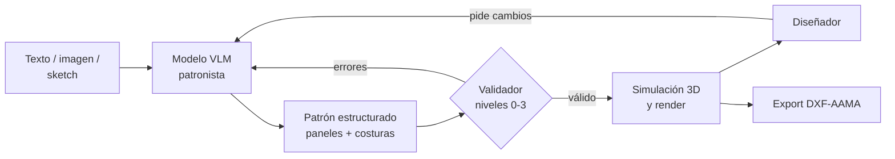

# Proyecto: Diseño de moda AI-First (patrones 2D generativos)

Documento de contexto del proyecto del que nace este repositorio. Versión de la
sesión de planeación del 21 de septiembre de 2026, revisada contra el código
efectivamente implementado. Los desajustes encontrados en esa revisión están
listados en [Cambios respecto a la versión original](#cambios-respecto-a-la-versión-original).

## Resumen ejecutivo

Una herramienta de diseño de moda AI-First: a partir de texto o imágenes, un
modelo propio genera los patrones 2D de la prenda, listos para simular en 3D y
fabricar. Es un proyecto personal a futuro, sin compromiso formal por ahora.

**Problema.** La IA generativa actual en moda produce imágenes, no patrones. Un
render de Midjourney no se puede enviar a una fábrica; alguien tiene que
traducirlo a patrones a mano.

**Propuesta.** El núcleo es un modelo que produce patrones 2D estructurados:
paneles, costuras, parámetros, materiales y texturas. La simulación, el 3D y el
render los hace la herramienta, reutilizando motores existentes.

**Principio de diseño.** El resultado debe ser iterable: el diseñador pide
cambios en lenguaje natural sobre lo generado, sin empezar de cero. Mostrar
varias opciones es un extra, no un requisito.

**Formato de entrega.** Plug-in para herramientas existentes o software completo
AI-Native; se decide más adelante.

## Estado del arte y diferencial

El espacio no está vacío, pero nadie ofrece aún una herramienta profesional,
iterativa y con alcance hasta alta costura. Exploración hecha en septiembre de
2026.

| Categoría | Ejemplos | Qué hace | Qué le falta |
| --- | --- | --- | --- |
| Software 3D de prendas | [CLO3D](https://www.clo3d.com/en/), Browzwear, Style3D, Marvelous Designer | Patrón 2D hecho a mano → simulación 3D | La IA no genera el patrón |
| Generadores de imágenes de moda | Midjourney, [Style3D AI](https://www.style3d.ai/ai-fashion-design/text-to-design), Fashion Diffusion | Texto o imagen → render | Son píxeles, sin datos de patrón |
| Generadores de estampados | [PatternedAI](https://www.patterned.ai/) | Texto → estampado repetible | Es superficie de tela, no corte |
| Patrones con IA (comercial) | [StitchLift](https://stitchlift.com/blog/ai-sewing-pattern-generator-how-it-works-2026), [fashionINSTA](https://fashioninsta.ai/blog/best-ai-pattern-making-tool-2026-fashioninsta-leads-production-ready) | Dicen generar patrones o DXF desde texto, foto o sketch | Calidad no verificada; foco en básicos y costura casera |
| Investigación | GarmentCode, ChatGarment, SewingLDM, AIpparel, Panelformer | Modelos de texto o imagen → patrón | Prototipos académicos, sin producto profesional |
| Open source | Blender, Valentina, Seamly2D, FreeSewing | Simulación de tela o trazado de patrones | Ninguno une IA, patrón y simulación |

**Diferencial buscado:** calidad profesional validada por patronistas, edición
iterativa en lenguaje natural, validación de manufacturabilidad integrada y un
camino hacia diseño innovador.

**Pendiente:** probar StitchLift y fashionINSTA a fondo. La parte de código
abierto está resuelta en la sección siguiente.

## Resultados de la fase 1

GarmentCode corre en CPU y genera patrones reales, pero su validez no está
garantizada: de 60 diseños muestreados al azar, solo 18 (30%) produjeron un
patrón válido. Pruebas hechas el 21 de septiembre de 2026 en un contenedor
Linux sin GPU. El detalle completo está en
[`hallazgos-fase1.md`](hallazgos-fase1.md).

| Hallazgo | Evidencia | Implicación |
| --- | --- | --- |
| GarmentCode funciona sin GPU | Camiseta generada con 8 paneles y 16 costuras; salida en JSON, SVG, PNG y PDF imprimible | Sirve como motor de patrones desde el día uno |
| La opción B no es válida por construcción | 30% de éxito en 60 muestras: 37% auto-intersección, 33% error (casi todo largo excedido) | Revisa la tabla de arquitectura: el validador hace falta igual |
| El formato no declara intención | 35% de costuras con desajuste mayor al 1%, 28% mayor al 5%, máximo 53% | Un validador no puede distinguir fruncido de defecto |
| Los fruncidos explican solo un tercio | Al desactivarlos, el desajuste baja de 35% a 24% y de 28% a 16%, pero el máximo sigue en 52% | El resto viene de embebidos no declarados |
| GarmentCode valida muy poco | Solo auto-intersección por pares de bordes y largo total contra la altura del cuerpo | Los niveles 0 y 1 del validador siguen siendo trabajo nuevo |
| ChatGarment tiene techo duro | Su salida es el esquema de parámetros de GarmentCode, clave por clave | No puede producir nada fuera de ese espacio; nada de alta costura |
| AIpparel sí usa geometría directa | Tokeniza como comandos de dibujo (MOVE, LINE, CURVE, CUBIC, ARC) y costuras como etiquetas compartidas, máximo 108 | Rompe el techo, pero sin garantía de validez |

> **Nota sobre el estado de la fase.** El criterio de salida era tener los tres
> sistemas corriendo; corrió uno. Las conclusiones sobre ChatGarment y AIpparel
> salen de **leer su código, no de ejecutarlo**, y sobre ellas se apoya la
> decisión de arquitectura (opción C en lugar de A). Correr AIpparel en una
> máquina con GPU es por tanto un **bloqueante de la fase 3**, no una tarea
> suelta: si su tasa de validez real resulta mejor de lo que sugiere el código,
> esa decisión se reabre.

### Representación de GarmentCode

Cada patrón es un JSON con paneles y costuras. Un panel tiene vértices en 2D,
bordes con curvatura Bézier cúbica opcional, una colocación 3D (traslación y
rotación) y una etiqueta semántica como `arm` o `torso`. Cada costura es un par
de referencias `{panel, edge}`, **sin ningún campo que indique si el desajuste
de longitud es intencional**. Esa carencia es una extensión concreta que el
proyecto debe aportar.

### Alcance real del espacio de diseño

Unos 80 parámetros: dos tipos de torso, cinco de falda y pantalón, más cuello,
manga, pretina y asimetría. Los patrones válidos dieron entre 10 y 18 paneles.
Es un buen punto de partida para prendas básicas y confirma que no alcanza para
diseño innovador.

### Lo que no se pudo correr

Ni ChatGarment ni AIpparel se ejecutaron. AIpparel se basa en LLaVA-v1.5-7B y
exige CUDA y flash-attention; ambos guardan sus pesos en Hugging Face, y tanto
Hugging Face como el repositorio de ETH con GarmentCodeData están bloqueados por
la política de red de este entorno. Es una limitación del contenedor, no del
proyecto: en una máquina con GPU y salida abierta, ambos deberían correr.

## Validador: estado real de lo construido

Está implementado y probado. Sobre 30 patrones que GarmentCode da por válidos,
el validador rechaza 23 (77%) por defectos que GarmentCode no mira.

| Hallazgo | Casos en 30 patrones | Veredicto |
| --- | --- | --- |
| Fruncido probable sin declarar | 258 | Aviso: intencional, pero indistinguible de un defecto |
| Desajuste de costura sin declarar | 111 | Error: entre 1% y 15%, muy chico para ser fruncido |
| Borde más corto que lo cortable | 51 | Error: hasta 0,07 cm; basura numérica en el panel |
| Esquina demasiado aguda | 15 | Error: solapas de 9° en mangas y cuellos |
| Auto-intersección | 2 | Error confirmado, y GarmentCode no lo detecta |
| Curvatura excesiva | 2 | Error: radio de 0,13 cm |

### Qué falta para cerrar el nivel 1

El nivel 1 definía cinco comprobaciones. El estado real es este:

| Comprobación | Estado | Nota |
| --- | --- | --- |
| Longitudes emparejadas | ✅ | Con `ease` para declarar la intención |
| Continuidad en los cruces | ✅ | Suma de angulos interiores en el vertice montado; ver nota de emparejamiento |
| Sin bordes sueltos | ✅ | Campo `finish` en el borde; sin declarar queda en aviso, no en error |
| Secuencia de ensamblaje factible | ⚠️ parcial | `costuras_en_redondo` mide el coste; la factibilidad real es accesibilidad 3D |
| Se puede poner | ↪️ movido | Necesita medidas corporales: pertenece al nivel 2 |

**La continuidad destapó un tercer hueco de formato, ya cerrado.** El JSON no
dice qué extremo de un borde se cose con cuál del otro, y no se puede deducir:
la colocación 3D es la posición inicial del simulador y deja los paneles
separados a 60 cm. La costura lo declara ahora con `orient`. Es el único de los
tres campos que no se puede contrastar contra la geometría — por eso hace falta
declararlo — pero sí contra la topología: un borde sin coser solo puede
continuar en otro borde sin coser, y en la camiseta de prueba `reversed` encaja
en 12 cruces frente a 4 de `direct`. Sin declaración, la continuidad subestima
y cada hallazgo dice si su emparejamiento fue declarado o deducido.

**"Sin bordes sueltos" necesita una segunda extensión de formato.** La regla
completa es "todo borde está cosido *o lleva dobladillo, vista o ribete*", y el
JSON no tiene dónde declarar ese acabado. Mientras no exista un campo `finish`
análogo a `ease`, `bordes_libres` no puede pasar de `info` a `error`, y
mientras sea `info` no filtra nada. Es el mismo hueco de formato que ya se
resolvió para los fruncidos, aplicado a los acabados.

## Usuarios y alcance

Primero diseñadores profesionales, porque pueden juzgar si el resultado sirve;
la democratización llega mucho después.

| Etapa | Usuario | Prendas | Objetivo |
| --- | --- | --- | --- |
| Early beta | Diseñadores y patronistas profesionales | Básicas: camiseta, falda, pantalón, vestido simple | Validar que los patrones son correctos y útiles |
| Madurez | Estudios y marcas | Prendas complejas, colecciones | Reducir muestras físicas y tiempo de desarrollo |
| Visión | Público general | Alta costura y moda innovadora | Una nueva forma de industria de la moda |

**Fuera de alcance en la beta:** accesorios, calzado, prueba virtual para
e-commerce y generación de fotos de marketing.

## Arquitectura del modelo

Decisión propuesta: un enfoque híbrido, donde el modelo produce una
representación estructurada del patrón que pasa por un validador y un reparador
antes de llegar al diseñador.

El validador devuelve errores concretos al modelo, que los corrige, igual que un
compilador con código. Los usos del validador dentro y fuera de este bucle están
detallados en [`roadmap.md`](roadmap.md).

### Opciones de representación

| Opción | Cómo funciona | A favor | En contra |
| --- | --- | --- | --- |
| A. Geometría directa | Difusión sobre curvas de paneles (tipo SewingLDM) | Muy creativa | Muchos patrones inválidos; iterar regenera todo |
| B. Programa o parámetros | LLM escribe un programa tipo GarmentCode (ChatGarment) | Iterar es editar; el patrón siempre compila | Limitado a lo que el lenguaje expresa; y no garantiza validez (30% medido) |
| C. Híbrido (propuesta) | Paneles Bézier editables + grafo de costuras, con validador y reparador | Iterable y extensible | Más ingeniería |

La beta arranca cerca de B, con plantillas de prendas básicas, y se abre hacia
geometría libre para alta costura.

### Qué produce el modelo

- **Paneles:** curvas cerradas, pinzas, piquetes, línea de hilo, márgenes de costura
- **Costuras:** qué borde se une con cuál, tipo de costura, fruncidos o embebidos declarados
- **Colocación:** posición inicial de cada panel sobre el avatar
- **Material:** peso, elasticidad por dirección, rigidez a flexión, grosor
- **Superficie:** color, textura o estampado
- **Ajuste:** medidas corporales objetivo y holgura deseada
- **Construcción:** orden de ensamblaje

Exportación a DXF-AAMA/ASTM, el formato estándar de la industria.

## Validación de manufacturabilidad

Una pila de validadores por niveles, de más barato a más caro; cada nivel filtra
antes de gastar cómputo en el siguiente.

| Nivel | Qué verifica | Costo | Herramientas |
| --- | --- | --- | --- |
| 0. Geometría | Polígonos cerrados, sin auto-intersecciones, radios mínimos cosibles, detalles cortables, cabe en el ancho del rollo | Milisegundos | Geometría computacional propia |
| 1. Topología y costura | Longitudes emparejadas, continuidad en cruces, bordes con acabado, secuencia de costura | Milisegundos | Reglas propias sobre el grafo de costuras |
| 2. Simulación física | Drapeado en varias tallas y poses, tensión, holgura por zona, se puede poner | Segundos a minutos | NVIDIA Warp (pipeline GarmentCode), Blender; luego CLO |
| 3. Producción | Consumo de tela, marcado, hilo, tipo de costura, costo, escalado de tallas | Segundos | Deepnest u otro nesting, reglas de confección |
| 4. Humana y física | Rúbrica de patronistas, toiles de una muestra | Días | Red de expertos |

### Detalle del nivel 2

- Sin interpenetración, simulación estable, la prenda no se cae
- Mapas de tensión: estiramiento más allá del límite del material = zona demasiado ajustada
- Holgura en busto, cintura, cadera y sisa comparada con el ajuste pedido
- **Se puede poner**: aberturas mayores que el cuerpo, o elasticidad o cierre suficiente
- Poses dinámicas: sentarse, brazos arriba, caminar

### Cómo se conecta con el modelo

1. **Saneado del dataset:** filtrar los datos de entrenamiento antes de usarlos
2. **Filtro:** generar N candidatos y mostrar solo los válidos
3. **Reparación:** errores estructurados vuelven al modelo para corregir
4. **Entrenamiento:** los puntajes sirven como recompensa de aprendizaje por refuerzo
5. **Optimización fina:** simulación diferenciable ajusta curvas para clavar el ajuste

### Reglas blandas: declarar en vez de prohibir

La alta costura rompe reglas a propósito, así que la regla no es "esto está
prohibido" sino "esto hay que declararlo". El mecanismo tiene tres piezas y solo
dos existen hoy:

| Pieza | Estado | Qué cubre |
| --- | --- | --- |
| Umbrales configurables (`Limites`) | ✅ | Ajuste global por material o taller |
| Intención en la costura (`ease`) | ✅ | Fruncidos y embebidos declarados |
| Excepción por hallazgo | ❌ | "Esta esquina de 9° es deliberada" |

Falta la tercera, y es la que convierte el validador de linter en herramienta de
diseño. `permitir_pinzas` es un interruptor global de todo o nada, no una
excepción localizada: hoy no hay forma de aceptar una violación concreta sin
desactivar la comprobación entera. Para la beta de prendas básicas no hace
falta; para la visión de alta costura es la pieza central.

## Estrategia de datos

Para la beta ya hay datos públicos suficientes; los contactos con patronistas
aportan lo que no existe: patrones reales de producción y correcciones de
expertos.

| Fuente | Qué aporta | Uso |
| --- | --- | --- |
| GarmentCodeData | Unas 115.000 prendas sintéticas con patrones, cuerpos y materiales | Pre-entrenamiento de básicos |
| Dataset de AIpparel | Prendas con texto, imagen y patrón | Entrenamiento multimodal |
| FreeSewing | Patrones paramétricos open source | Plantillas y validación |
| Contactos del sector | Archivos DXF de producción reales | Calidad profesional |
| Revisiones de expertos | Correcciones sobre patrones generados | El dato más valioso: preferencias y recompensas |

Las descripciones de texto se generan con modelos de visión a partir de renders
de cada prenda.

**Sanear antes de entrenar.** El hallazgo de que 23 de 30 patrones que
GarmentCode aprueba tienen defectos se aplica igual a las 115.000 prendas de
GarmentCodeData: un modelo entrenado sobre ese corpus aprende los defectos como
correctos. Pasar el validador sobre el dataset y filtrar o ponderar por puntaje
es prerrequisito del pre-entrenamiento, no una mejora posterior.

**Licencias.** Confirmar las de GarmentCodeData y el dataset de AIpparel antes
de invertir en el pipeline de entrenamiento. Es la pregunta abierta con mayor
radio de impacto: si alguna resulta no comercial, la base de pre-entrenamiento
de la beta desaparece y la estrategia de datos hay que rehacerla.

## Hoja de ruta

Cinco fases; el validador va antes que el modelo porque no depende de él y ya es
útil por sí solo. Sin fechas: es un proyecto personal a futuro.

| Fase | Entregable | Criterio de salida |
| --- | --- | --- |
| 1. Reproducir lo existente | GarmentCode, ChatGarment y AIpparel corriendo; informe de fallos | Diferencial definido con evidencia |
| 2. Validador (niveles 0 a 2) | Un "linter de patrones" con simulación | Detecta errores conocidos en patrones de prueba |
| 3. Modelo v1 | VLM afinado que produce el patrón estructurado, con bucle de reparación | La mayoría de básicos pasan el validador |
| 4. Iteración y pruebas | Edición en lenguaje natural; pruebas con diseñadores | Patronistas aprueban según la rúbrica |
| 5. Geometría libre | Extensión hacia diseño innovador y alta costura | Por definir |

El linter de la fase 2 puede mostrarse a patronistas desde temprano para abrir
conversaciones y conseguir datos. El desglose de la fase 2 está en
[`roadmap.md`](roadmap.md).

## Riesgos y preguntas abiertas

El riesgo mayor es la brecha entre simulación y realidad: pasar la simulación no
garantiza que la prenda real quede bien.

| Riesgo | Impacto | Mitigación |
| --- | --- | --- |
| Sin patronista identificado | Bloquea calibración, rúbrica y el dato más valioso a la vez | Empezar las conversaciones ya: es el plazo más largo y no depende de nada técnico |
| Licencias de datasets restrictivas | Desaparece la base de pre-entrenamiento | Verificar antes de construir el pipeline de datos |
| Parámetros de material irreales | El nivel 2 da falsa confianza | Medir telas reales (tipo Fabric Kit de CLO); toiles físicos |
| Poca data profesional | Resultados de nivel aficionado | Red de patronistas; bucle de correcciones |
| Alta costura rompe reglas | El validador rechaza diseños válidos | Reglas blandas y configurables; falta la excepción por hallazgo |
| Competidores avanzan | Menor diferencial | Enfocar en calidad profesional e iteración |
| Costo de GPU para entrenar | Freno al desarrollo | Empezar con fine-tuning pequeño; créditos académicos o de nube |

> **Por qué el patronista encabeza la tabla.** Aparece a la vez como mitigación
> del riesgo de datos, como recurso crítico y como criterio de salida de la fase
> 4, y no tiene sustituto: ni los umbrales, ni la rúbrica, ni las correcciones
> de experto se pueden conseguir por otra vía.

### Preguntas abiertas

- [ ] ¿Qué licencias tienen GarmentCodeData y el dataset de AIpparel?
- [ ] ¿Quién sería el socio o asesor patronista?
- [ ] ¿Qué motor de simulación usar en la beta? (bloquea el nivel 2)
- [ ] ¿Plug-in sobre CLO o Blender, o software propio?
- [ ] ¿Qué tan buenos son hoy StitchLift y fashionINSTA?

## Recursos y próximos pasos

La pieza humana más crítica, después del modelo, es un patronista experto como
socio o asesor.

| Recurso | Quién | Nota |
| --- | --- | --- |
| Desarrollo de software y ML | Tú, con apoyo de Claude | Validador, simulación, datos, fine-tuning, interfaz |
| Criterio de patronaje | Socio o asesor experto | Rúbrica, revisiones, datos reales |
| Cómputo GPU | Por conseguir | Entrenamiento y simulación masiva |
| Pruebas físicas | Taller de confección | Toiles para validar |

### Próximos pasos

Ordenados por plazo, no por dificultad: lo que depende de terceros va primero
porque tarda más en madurar.

- [x] Correr GarmentCode y documentar su tasa de validez y sus límites
- [x] Analizar la arquitectura y el techo de ChatGarment y AIpparel
- [x] Extender el formato de costura con un campo de intención declarada
- [x] Construir el nivel 0 y 1 del validador sobre el JSON de GarmentCode
- [ ] Identificar 2 o 3 patronistas para conversaciones iniciales
- [ ] Revisar licencias de datasets
- [ ] Cerrar el nivel 1: continuidad en los cruces de costura
- [ ] Añadir el campo `finish` y subir `bordes_libres` a error
- [ ] Correr AIpparel en una máquina con GPU (bloquea la fase 3)
- [ ] Calibrar umbrales con un patronista y telas reales
- [ ] Probar StitchLift y fashionINSTA con 3 prendas básicas

## Cambios respecto a la versión original

Esta versión corrige seis desajustes detectados al contrastar el documento de la
sesión con el código implementado:

1. **Nivel 1 declarado completo, estaba a medias.** Añadida la tabla de estado
   real: de cinco comprobaciones hay dos y media. La secuencia de ensamblaje no
   estaba listada como pendiente en ningún sitio.
2. **"Sin bordes sueltos" necesita un campo `finish`.** El hueco de formato es
   el mismo que resolvió `ease`, pero para acabados, y no estaba identificado.
3. **"Se puede poner" aparecía en el nivel 1.** Movido al nivel 2: necesita
   medidas corporales.
4. **Las reglas blandas se daban por resueltas.** Falta la excepción por
   hallazgo; solo existen los umbrales globales y `ease`.
5. **La fase 1 se cerró con un criterio de salida incumplido.** Corrió uno de
   tres sistemas; el techo de AIpparel es una conclusión leída, no medida, y por
   eso correrlo pasa a bloquear la fase 3.
6. **Riesgos sin dueño.** El patronista y las licencias de datasets suben al
   principio de la tabla y de los próximos pasos: son los de plazo más largo y
   mayor radio de impacto.

Además se incorpora el saneado del dataset como paso previo al
pre-entrenamiento, que no figuraba en la estrategia de datos.

## Fuentes

- [Automating the creation of fashion patterns using deep learning (Frontiers, 2026)](https://www.frontiersin.org/journals/artificial-intelligence/articles/10.3389/frai.2026.1828627/full)
- [Textile IR: representación intermedia para CAD de moda (arXiv)](https://arxiv.org/pdf/2601.02792)
- [CLO vs Marvelous Designer (soporte CLO)](https://support.clo3d.com/hc/en-us/articles/115012666547-What-is-the-difference-between-CLO-and-Marvelous-Designer)
- [Alternativas a CLO3D (AlternativeTo)](https://alternativeto.net/software/clo3d)
